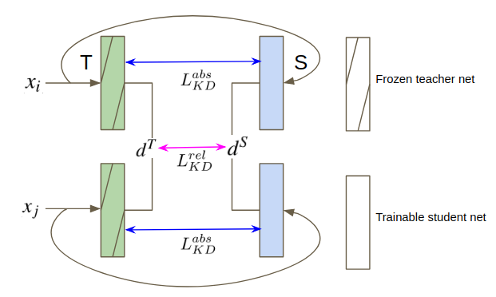

# EmbeddingDistillation
Learning Metrics from Teachers: Compact Networks for Image Embedding.

The paper will be published at the conference of 2019 Computer Vision and Pattern Recognition (CVPR19). 

## Abstract
Metric learning networks are used to compute image embeddings, which are widely used in many applications such as image retrieval and face recognition. In this paper, we propose to use network distillation to efficiently compute image embeddings with small networks. Network distillation has been successfully applied to improve image classification, but has hardly been explored for metric learning. To do so, we propose two new loss functions that model the communication of a deep teacher network to a small student network. We evaluate our system in several datasets, including CUB-200-2011, Cars-196, Stanford Online Products and show that embeddings computed using small student networks perform significantly better than those computed using standard networks of similar size. Results on a very compact network (MobileNet-0.25), which can be used on mobile devices, show that the proposed method can greatly improve Recall@1 results from 27.5\% to 44.6\%. Furthermore, we investigate various aspects of distillation for embeddings, including hint and attention layers, semi-supervised learning and cross quality distillation.

## Authors
Lu Yu, Vacit Oguz Yazici, Xialei Liu, Joost van de Weijer, Yongmei Cheng, Arnau Ramisa 

## Framework


## Datasets
We evaluate our system in several datasets, including ```CUB-200-2011, Cars-196, Stanford Online Products```.

The first half of classes are used for training and the remaining half for testing. For instance, on CUB-200-2011 dataset, 100 classes (5,864 images) are for training and the remaining 100 classes (5,924 images) are for testing. 

Please download [CUB-200-2011](http://www.vision.caltech.edu/visipedia/CUB-200-2011.html) , [Cars-196](https://ai.stanford.edu/~jkrause/cars/car_dataset.html), [Stanford Online Products](http://cvgl.stanford.edu/projects/lifted_struct/) datasets first, the ```sprit_data``` function is then used to sprit the train and test set.

## Requirments
All training and test are done in [Pytorch](https://pytorch.org/) framework.

Pytorch vesion: 0.3.0.post4

Python version: 2.7

## Pre-trained Teacher Model (ResNet-101)
The pre-trained [Teacher models](https://drive.google.com/drive/folders/19gOzU01XzyzX0MoTxrOXVU-U4Zj0o22r?usp=sharing) on cub, cars and products are available to download.

## Relative Teacher and Absolute Teacher
The code of ```relative teacher``` and ```absolute teacher``` is available in the folder.
```
./run_main.sh
```

